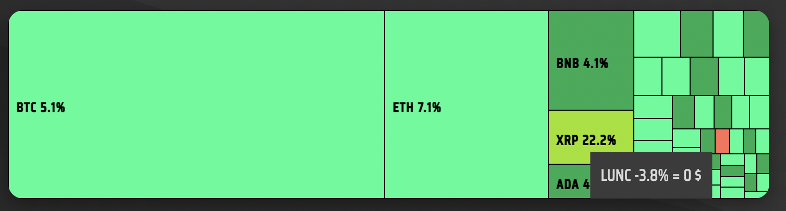
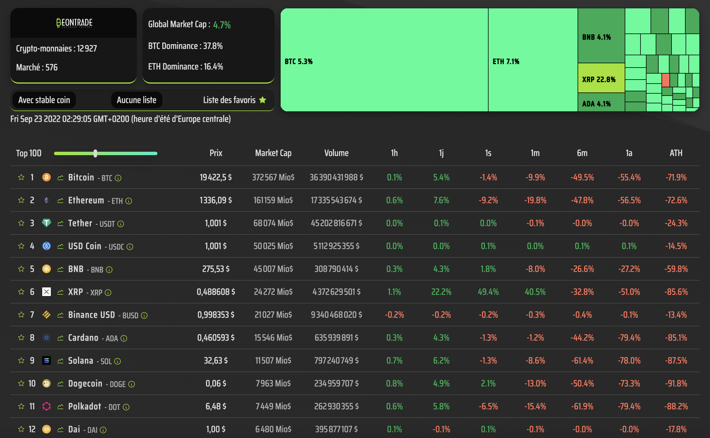
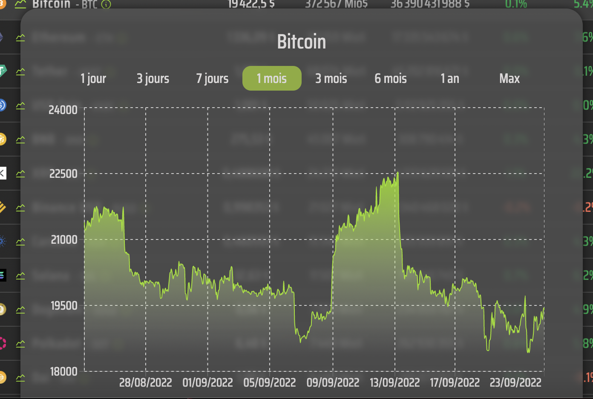

# ₿eontrade WatchList 🇺🇸

[](https://wakatime.com/badge/user/933ebfa6-42e4-4a54-b3fc-658e9f1ab22f/project/966d1b96-0d87-43ee-96c6-de90f183c69e)
[](https://badge.fury.io/gh/mikaeltrilles%2Fbeontrade-watcher)
[](http://commonmark.org)
[](https://www.buymeacoffee.com/mtdevweb)


-red)


This single page application centralizes information on the top 250 crypto currencies.
It is made with the javascript library React.

You can :

1. Create a favorites list of your favorite crypto.
2. View the percentage of gain/loss from 1 hour to 1 year.
3. View the percentage between the ATH and the current value.
4. View the chart of the selected crypto.
5. Filter by ascending/descending order of market cap.

## Getting Started

In order to facilitate the reading of the code and the exploration of the code, I suggest you to install [Visual Studio Code](https://code.visualstudio.com/download) and the code comment colorization plugin [Colorful Comments](https://marketplace.visualstudio.com/items?itemName=ParthR2031.colorful-comments) for VSCode.

### Installation

Clone this repository on your computer.

```bash
git clone https://github.com/mikaeltrilles/beontrade-watcher.git
```

Execute the following command to install the dependencies:

```bash
npm install
```

In the end, you'll get this...

## Start

Run the application:

```bash
npm start
```

Enjoy !!

## Made with ❤️ by Mikael Trilles

Entrez les programmes/logiciels/ressources que vous avez utilisé pour développer votre projet

Sofwares :

* [ReactJS](https://reactjs.org/) - JavaScript library (front-end)
* [Visual Studio Code](https://code.visualstudio.com/download) - IDE
* [Recharts documentation](https://recharts.org/en-US/examples/CustomContentTreemap) - Custom Treemap


Tools :

* [Colorful Comments](https://marketplace.visualstudio.com/items?itemName=ParthR2031.colorful-comments) - Code comment colorization plugin
* [Wakatime](https://wakatime.com/) - Time tracking
* [GitHub](https://github.com/mikaeltrilles/beontrade-watcher) - GitHub repository

API :

* [Coingecko website](https://www.coingecko.com/en)  
* [Coingecko API documentation](https://www.coingecko.com/en/api/documentation)
* [Global Market Data](https://api.coingecko.com/api/v3/global)

```json
{
"data": {
  "active_cryptocurrencies": 13421,
  "upcoming_icos": 0,
  "ongoing_icos": 49,
  "ended_icos": 3376,
  "markets": 525,
  "total_market_cap": {
    "btc": 46586435.06132786,
    "eth": 868384140.8772379,
    "ltc": 19025428811.27638,
    "bch": 9201965703.97502,
    "bnb": 4072055427.301049,
    "eos": 980790971380.8069,
    "xrp": 2918614214873.1353,
    "xlm": 8972572517920.27,
    "link": 149005724500.2516,
    "dot": 141884008399.4614,
    "yfi": 164023330.07140785,
    "usd": 906296017620.7732,
    "aed": 3328870587521.9756,
    "ars": 115621160345610.67,
    "aud": 1340293991578.8313,
    "bdt": 84641808197698.53,
    "bhd": 341637346802.32587,
    "bmd": 906296017620.7732,
    "brl": 4928437743821.734,
    "cad": 1179907691636.5012,
    "chf": 889880277853.608,
    "clp": 920697061340764.5,
    "cny": 6094659459296.174,
    "czk": 22050182108713.35,
    "dkk": 6715345349923.936,
    "eur": 902584735428.6146,
    "gbp": 762057193824.3912,
    "hkd": 7114378423522.188,
    "huf": 367774338483281.4,
    "idr": 13578309326255338,
    "ils": 3147615915477.9053,
    "inr": 72026709597435.97,
    "jpy": 123996249094812.38,
    "krw": 1184627099454223,
    "kwd": 279138267131.1799,
    "lkr": 326068184489292.3,
    "mmk": 1676982199023698.5,
    "mxn": 18894825518948.945,
    "myr": 4021235430183.363,
    "ngn": 376402862038258.44,
    "nok": 9290707833955.729,
    "nzd": 1478177867699.656,
    "php": 51042595337585.77,
    "pkr": 187874116774589.34,
    "pln": 4352605349402.0605,
    "rub": 52950347548381.4,
    "sar": 3401752194370.982,
    "sek": 9581982311058.885,
    "sgd": 1275936098775.546,
    "thb": 32800969078896.844,
    "try": 15685446436166.232,
    "twd": 27086922226640.777,
    "uah": 26758089936271.44,
    "vef": 90747420244.36789,
    "vnd": 21201889036220320,
    "zar": 15425175439529.865,
    "xdr": 669116537217.3787,
    "xag": 47898949904.961174,
    "xau": 525298234.7731769,
    "bits": 46586435061327.86,
    "sats": 4658643506132786
  },
  "total_volume": {
    "btc": 3965330.0369009497,
    "eth": 73914857.68026459,
    "ltc": 1619400673.8433747,
    "bch": 783250123.2702069,
    "bnb": 346603977.6717386,
    "eos": 83482668154.74847,
    "xrp": 248425718712.47733,
    "xlm": 763724703698.4828,
    "link": 12683024023.049042,
    "dot": 12076839953.98326,
    "yfi": 13961288.01502962,
    "usd": 77141829295.68277,
    "aed": 283345796094.50714,
    "ars": 9841406826176.73,
    "aud": 114082737090.50624,
    "bdt": 7204515734722.038,
    "bhd": 29079383971.300507,
    "bmd": 77141829295.68277,
    "brl": 419497267709.92035,
    "cad": 100431024701.8786,
    "chf": 75744559341.65005,
    "clp": 78367612963190.94,
    "cny": 518763373647.60736,
    "czk": 1876860706763.9565,
    "dkk": 571594726859.0485,
    "eur": 76825933504.71683,
    "gbp": 64864552879.6162,
    "hkd": 605559502879.6449,
    "huf": 31304104494566.254,
    "idr": 1155754411146778,
    "ils": 267917815944.51672,
    "inr": 6130747601740.059,
    "jpy": 10554275087832.77,
    "krw": 100832729823795.78,
    "kwd": 23759606281.24094,
    "lkr": 27754172740005.695,
    "mmk": 142740861720431.84,
    "mxn": 1608284022455.4253,
    "myr": 342278296584.9438,
    "ngn": 32038544543082.875,
    "nok": 790803648949.6849,
    "nzd": 125819094999.55145,
    "php": 4344628134500.15,
    "pkr": 15991412037040.324,
    "pln": 370483740772.15326,
    "rub": 4507011608025.726,
    "sar": 289549310580.9777,
    "sek": 815596261467.0258,
    "sgd": 108604741508.5613,
    "thb": 2791942928382.1577,
    "try": 1335109067986.2397,
    "twd": 2305576423074.712,
    "uah": 2277586976009.532,
    "vef": 7724211367.376704,
    "vnd": 1804655954543198.8,
    "zar": 1312955400307.275,
    "xdr": 56953658285.34375,
    "xag": 4077048276.909787,
    "xau": 44712175.67807074,
    "bits": 3965330036900.9497,
    "sats": 396533003690094.94
  },
  "market_cap_percentage": {
    "btc": 40.98223436686339,
    "eth": 13.756016258987957,
    "usdt": 7.306752674011379,
    "usdc": 6.116635622032319,
    "bnb": 4.011386462905801,
    "busd": 1.9783653683205917,
    "xrp": 1.6584562903432374,
    "ada": 1.599236450170733,
    "sol": 1.2606813778371193,
    "doge": 0.8859040004429497
  },
  "market_cap_change_percentage_24h_usd": -5.540755106425886,
  "updated_at": 1657655908
  }
}
```

* [Detailed data by crypto](https://api.coingecko.com/api/v3/coins/markets?vs_currency=usd&order=market_cap_desc&per_page=250&page=1&sparkline=false&price_change_percentage=1h%2C24h%2C7d%2C14d%2C30d%2C200d%2C1y)

```json
{
  "id": "bitcoin",
  "symbol": "btc",
  "name": "Bitcoin",
  "image": "https://assets.coingecko.com/coins/images/1/large/bitcoin.png?1547033579",
  "current_price": 19376.91,
  "market_cap": 370184957069,
  "market_cap_rank": 1,
  "fully_diluted_valuation": 407176986271,
  "total_volume": 22047492727,
  "high_24h": 20551,
  "low_24h": 19389.38,
  "price_change_24h": -1092.323598869105,
  "price_change_percentage_24h": -5.33642,
  "market_cap_change_24h": -20552537797.075623,
  "market_cap_change_percentage_24h": -5.25993,
  "circulating_supply": 19092150,
  "total_supply": 21000000,
  "max_supply": 21000000,
  "ath": 69045,
  "ath_change_percentage": -71.57874,
  "ath_date": "2021-11-10T14:24:11.849Z",
  "atl": 67.81,
  "atl_change_percentage": 28839.21358,
  "atl_date": "2013-07-06T00:00:00.000Z",
  "roi": null,
  "last_updated": "2022-07-12T19:35:29.261Z",
  "price_change_percentage_14d_in_currency": -6.623974095728785,
  "price_change_percentage_1h_in_currency": -2.2306818244894235,
  "price_change_percentage_1y_in_currency": -43.50746340900359,
  "price_change_percentage_200d_in_currency": -61.931884214191705,
  "price_change_percentage_24h_in_currency": -5.33641798831299,
  "price_change_percentage_30d_in_currency": -31.709290142495224,
  "price_change_percentage_7d_in_currency": -4.344704340631712
}
```

## Here is a preview of the site



## Coingecko API & Chart

Coin price chart API structure :

```url
https://api.coingecko.com/api/v3/coins/${coinId}/market_chart?vs_currency=usd&days=${duration}${duration > 32 ? "&interval=daily" : ""}
```



[](https://www.buymeacoffee.com/mtdevweb)
[](https://www.buymeacoffee.com/mtdevweb)
[](https://www.buymeacoffee.com/mtdevweb)

## If you like this project, please consider donating with Bitcoin or Buy my a coffee

[](https://www.buymeacoffee.com/mtdevweb)
