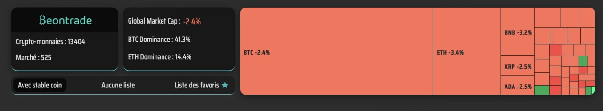

# Beontrade Watchlist


Utilisation de l'api de Coingecko pour récupérer les données nécessaire à la watchlist.  

Lien du site [Coingecko](https://www.coingecko.com/fr)  

Lien de la doc : [Documentation API Coingecko](https://www.coingecko.com/fr/api/documentation)  

Liste des API utilisé pour la récupération des données :

* [Donnée Globale du Marché](https://api.coingecko.com/api/v3/global)

* [Donnée détaillé par crypto](https://api.coingecko.com/api/v3/coins/markets?vs_currency=usd&order=market_cap_desc&per_page=250&page=1&sparkline=false&price_change_percentage=1h%2C24h%2C7d%2C14d%2C30d%2C200d%2C1y)

Base de l'adresse pour l'acces au détail de la crypto : "https://www.coingecko.com/fr/pi%C3%A8ces/"  

-------

Utilisation de recharts treemap pour afficher les données de la watchlist de type [coin360](https://www.coin360.com/). 
Lien de la doc : [https://recharts.org/en-US/examples/CustomContentTreemap](https://recharts.org/en-US/examples/CustomContentTreemap)  

Installation de recharts treemap :

```bash
npm install recharts
```

Ce qui nous donne ce joli résultat :  
  

Coin price chart : `https://api.coingecko.com/api/v3/coins/${coinId}/market_chart?vs_currency=usd&days=${duration}${duration > 32 ? "&interval=daily" : ""}`
